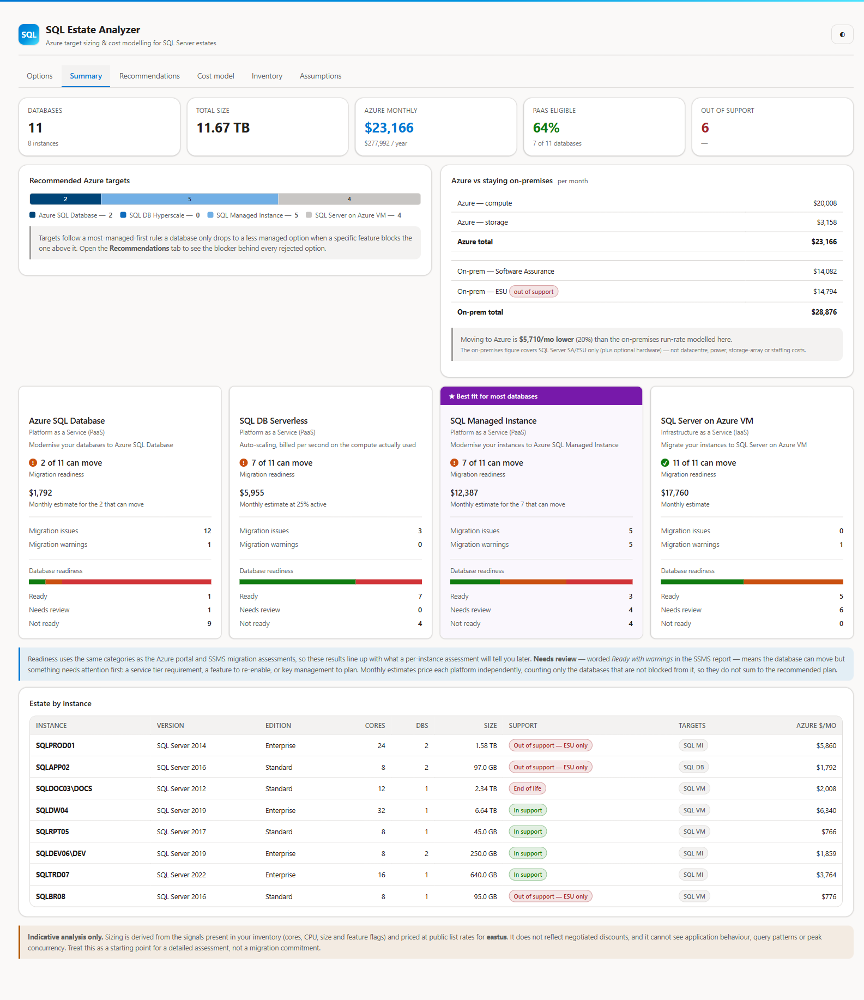

# SQL Estate Analyzer

**▶ Open the analyzer: https://krishna-sunkavalli.github.io/sql-estate-analyzer/**

Upload a SQL Server inventory and get Azure target recommendations — Azure SQL
Database, Hyperscale, SQL Managed Instance, or SQL Server on Azure VM — with the
specific blocker behind every rejected option and costed scenarios across pricing
terms and Azure Hybrid Benefit.

Built for estate-scale triage: point it at a thousand databases and get a costed
shortlist in minutes, rather than assessing one instance at a time.



> **Your data never leaves your browser.** The page is a single static HTML file
> with no network calls, no storage APIs and no telemetry. Files you drop in are
> parsed in memory and discarded when you close the tab. Nothing is uploaded.
> A CI check on every commit fails the build if `fetch`, `XMLHttpRequest`,
> browser storage or any external `script`/`link` reference appears in the bundle.

---

## How to use it

**Whole estate, one command** — run the sweep and upload the single CSV it writes:

```powershell
# See what it finds, without querying anything
.\discovery\Invoke-SqlEstateDiscovery.ps1 -FromActiveDirectory -ListOnly

# Collect
.\discovery\Invoke-SqlEstateDiscovery.ps1 -FromActiveDirectory
```

**One instance, or no PowerShell** — run
[`discovery/SqlEstateDiscovery.sql`](discovery/SqlEstateDiscovery.sql) in SSMS,
right-click the grid → *Save Results As…* → CSV. Upload as many of those as you
like together.

Either way, open the [analyzer](https://krishna-sunkavalli.github.io/sql-estate-analyzer/)
and drop the files in. No install, no sign-in, no agent. Works offline — use
**Save Page As** if you need to run it on a disconnected network.

The inventory is **entirely machine-generated**. There are no columns for anyone to
fill in, nothing is inferred from a label a human typed, and the analysis is driven
only by what the collector read out of the engine. Judgement calls SQL Server cannot
answer for itself — whether the estate is under Software Assurance, for instance —
live on the **Assumptions** tab, where they are visible and adjustable rather than
buried in a spreadsheet column.

Want to see it first? Load [`samples/sample-discovery-output.csv`](samples/sample-discovery-output.csv).

## Sweeping the estate

`Invoke-SqlEstateDiscovery.ps1` runs the discovery script against every instance
in one pass and merges the results. It needs **no PowerShell modules** — just
`System.Data.SqlClient` and ADSI, both present in Windows PowerShell 5.1 and
PowerShell 7. Under PowerShell 7 instances are queried in parallel.

It writes two files:

| File | Contents |
|---|---|
| `SqlEstateInventory-<timestamp>.csv` | One row per database, every instance — upload this |
| `SqlEstateInventory-<timestamp>-log.csv` | Per-instance status, row count, duration and failure reason |

### Finding the instances

| Source | Switch | Notes |
|---|---|---|
| Active Directory | `-FromActiveDirectory` | Finds every SQL Server by its `MSSQLSvc` SPN. Any authenticated domain user can read SPNs — no elevated rights, no RSAT. Disabled computer accounts are skipped. |
| Central Management Server | `-FromCentralManagementServer CMS01` | Reads the registered server list from the CMS `msdb`. |
| A list you already have | `-InputFile .\servers.txt` | One instance per line, or a CSV with an `Instance` / `ServerInstance` / `ServerName` column. |
| Named directly | `-Instance SQLPROD01,SQLPROD02\FIN` | |

`-ListOnly` resolves the target list and stops — always worth running first.

SPN discovery finds instances that have a Kerberos SPN registered, which covers
the large majority. Instances running under a domain account whose SPN was never
registered will not appear, so reconcile against a CMS or CMDB list if you need
completeness.

### Other options

```
-Credential           SQL authentication (Windows auth is the default)
-ThrottleLimit 16     parallel instances, PowerShell 7 only (default 8)
-ConnectTimeoutSec    default 8 — lower it when sweeping a list full of dead hosts
-QueryTimeoutSec      default 900 — a large or AUTO_CLOSE-heavy instance needs it
-Encrypt              force an encrypted connection
-TrustServerCertificate
-OutputPath           default .\SqlEstateInventory-<timestamp>.csv
```

Instances that fail are logged and the sweep continues. Results are written as each
instance completes, so an interrupted sweep still leaves usable output. Failures
are also written to `SqlEstateInventory-<timestamp>-retry.txt` — feed that straight
back in with `-InputFile` to retry just those.

Permissions needed on each instance: `VIEW SERVER STATE` and `VIEW ANY DEFINITION`
(sysadmin is simplest).

### How long does it take, and what does it cost the server?

Short version: **a 1,000-database estate is minutes, not hours**, and the load on
each server is negligible.

The collector reads catalog views and DMVs only. It runs no trace, no Extended
Events session, no `DBCC`, and touches no user data — so there is nothing to block
and nothing to bloat. It is safe to run during business hours.

Measured on SQL Server 2019 (see below for the caveat on these figures):

| Cost | Measured |
|---|---|
| Per instance, fixed | ~1 s — connect plus the instance-level DMV queries |
| Per database, small schema | 1–5 ms |
| Per database, 1,500+ objects | 20–40 ms |
| Per database, `AUTO_CLOSE ON` | **~425 ms** — see below |

Which works out roughly as:

| Estate shape | Expected wall clock |
|---|---|
| 1,000 databases on a few large instances | well under a minute |
| 1,000 databases spread over ~200 instances, `-ThrottleLimit 16` | a few minutes |
| Either of the above, with many unreachable hosts | dominated by connect timeouts, not by the query |

In a real sweep the largest cost is usually **hosts that don't answer** — stale
SPNs for decommissioned servers, each burning the full `-ConnectTimeoutSec`.
Parallelism absorbs that: 16 unreachable hosts at a 3 s timeout took 15.9 s at
`-ThrottleLimit 4` and 5.6 s at `-ThrottleLimit 16`. For a large estate, raise the
throttle and lower the connect timeout:

```powershell
.\Invoke-SqlEstateDiscovery.ps1 -FromActiveDirectory -ThrottleLimit 24 -ConnectTimeoutSec 4
```

The run log records per-instance duration and row count, and the console prints
the slowest instance — so if one server is an outlier you will know which.

**The `AUTO_CLOSE` caveat.** On a database with `AUTO_CLOSE ON`, every `USE`
statement has to start the database up, which measured at ~425 ms versus ~5 ms
with it off — a 1,000-database instance goes from seconds to roughly seven
minutes. `AUTO_CLOSE ON` is a poor setting for a server database and is off by
default on non-Express editions, but it is common on SQL Express and on estates
that grew out of desktop deployments. The collector reports `IsAutoClose` per
database, so you can see whether this applies to you. `-QueryTimeoutSec` defaults
to 900 s to leave room for it.

These figures come from a laptop-class instance, and per-database cost varies with
schema size rather than data volume — a 4 TB database with 40 tables is cheaper to
inspect than a 40 GB database with 4,000. Treat them as the right order of
magnitude, not a guarantee. Run `-ListOnly` first, then one representative
instance, and read the actual duration out of the run log before sweeping
everything.

## How this relates to Microsoft's own tooling

This is a **triage** tool, not a replacement for Microsoft's assessment tooling.
Use it to get an estate-wide, costed shortlist quickly; use Microsoft's tooling to
make the final per-database call.

| | This analyzer | [SSMS Migrate SQL Server / Arc-enabled assessment](https://learn.microsoft.com/ssms/migrate/migrate-sql-server-azure-sql#assess-readiness-for-migration) |
|---|---|---|
| Scope | Whole estate in one sweep | Per instance |
| Permission | `VIEW SERVER STATE` + `VIEW ANY DEFINITION` | sysadmin |
| Compatibility findings | Feature-flag heuristics, reported as Ready / Needs review / Not ready | The same categories, from the authoritative rule set, with remediation detail |
| Sizing | Inferred from cores, size and ring-buffer CPU | Performance-based when Arc-enabled |
| Cost model | Yes — PAYG, reserved, AHB, vs on-premises | No |

A sensible sequence is: sweep the estate here to find the candidates and size the
prize, then run the SSMS assessment — or read the precomputed Arc assessment — on
the instances you have decided to move. Where this tool says a database is blocked
from Azure SQL Database, expect the SSMS assessment to categorise it **Not ready**
for that target and to tell you exactly what to fix.

## What the discovery script collects

Versions, editions, core and memory counts, database sizes, compatibility levels,
I/O rates, and feature flags (FILESTREAM, In-Memory OLTP, CLR, Service Broker,
cross-database dependencies, replication, and so on) plus instance-scope signals
(Agent jobs, linked servers, SSIS, SSRS, clustering, availability groups).

### Resource detail

| Signal | Source |
|---|---|
| Logical cores, sockets, cores per socket, online schedulers | `sys.dm_os_sys_info`, `sys.dm_os_schedulers` |
| Installed RAM, configured max server memory | `sys.dm_os_sys_info`, `sys.configurations` |
| SQL memory target vs actually in use | `sys.dm_os_sys_info.committed_target_kb`, `sys.dm_os_process_memory` |
| Working set per database | `sys.dm_os_buffer_descriptors` |
| Read/write IOPS and throughput per database | `sys.dm_io_virtual_file_stats` |
| Average and peak CPU, plus the number of samples behind them | `sys.dm_os_ring_buffers` |

Two of these are worth understanding before you quote a number from them.

**CPU is a short window.** The scheduler-monitor ring buffer holds one sample per
minute up to roughly 256, so a reading on a recently restarted instance is a
snapshot of an idle server rather than a workload profile. The script reports
`CpuSampleCount` alongside the percentages, and the analyzer flags any instance
with under an hour of history as unreliable rather than letting it quietly drive
right-sizing. Where real perfmon history exists, prefer it.

**Working set is more useful than file size for memory.** A 4 TB database with a
2 GB hot set has very different requirements from a 40 GB database that is fully
cached, and `BufferPoolMB` is the difference between the two. It reflects the
buffer pool at the moment of collection, so it is most meaningful on an instance
that has been up long enough to reach a steady state.

Performance counters are deliberately avoided: `sys.dm_os_performance_counters`
exposes only a partial set on some installs — LocalDB, for instance, carries just
the In-Memory OLTP counters — so every resource signal above comes from a DMV that
is present on all editions.

It is strictly read-only and collects **no schema, no data, no object names and no
query text** — safe to hand to a DBA for review before running.

Requires SQL Server 2012 or later and `VIEW SERVER STATE` + `VIEW ANY DEFINITION`.

### What it cannot collect, and where that goes instead

Some things that affect the numbers are simply not visible to the database engine.
Rather than emit blank columns and invite someone to annotate the CSV — which would
make the analysis only as trustworthy as whoever filled in the spreadsheet — those
are **estate-wide assumptions on the Assumptions tab**:

| Assumption | Default | Effect |
|---|---|---|
| Software Assurance active | On | Charges an SA renewal per instance, and allows an ESU line where a version is out of support. Turning it off zeroes both, since ESU cannot be bought without active SA |

Leaving SA on is the conservative choice: it raises the on-premises run-rate and so
makes Azure look better. Turn it off if the customer is not under SA.

Everything is priced as **production**. The collector cannot distinguish a dev
database from a production one, so nothing is discounted on the basis of a guess.

Where a collected signal can legitimately come back empty, the analyzer shows a
**Source data coverage** card naming the field and the fallback applied — so a
default is never mistaken for a measurement. The common case is `AvgCpuPct` and
`PeakCpuPct`, which come from the ring buffer and are empty on a recently restarted
instance; sizing then matches the existing core count instead of right-sizing from
observed demand.

## How recommendations are made

Each database is tested against a rule set of features unsupported on specific
Azure targets. The analyzer picks the **most managed platform with no violations**
— SQL Database, then Managed Instance, then SQL Server on Azure VM — and always
shows the blocker behind each rejected option, so the recommendation is auditable
rather than a black box.

Hyperscale is proposed only above the 4 TB single-database limit. Business Critical
is selected where the source uses In-Memory OLTP, is clustered, participates in an
availability group, or runs Enterprise edition in production.

Managed Instance and SQL-on-VM are instance-level products, so databases from the
same source instance are consolidated onto one deployment and share its compute
cost rather than each being billed a full instance.

### Readiness

Every database is also reported against **every** target using the categories the
[Azure portal](https://learn.microsoft.com/sql/sql-server/azure-arc/migration-assessment)
and [SSMS](https://learn.microsoft.com/ssms/migrate/migrate-sql-server-azure-sql#assess-readiness-for-migration)
migration assessments use, so these results line up with what a per-instance
assessment will tell your customer later:

| Category | Meaning |
|---|---|
| **Ready** | Nothing detected that needs changing |
| **Needs review** | It can move, but something needs attention first. The SSMS report words this *Ready with warnings* |
| **Not ready** | A feature rules that target out until it is removed or reworked |

The summary presents this as one card per target — readiness, monthly estimate,
issue and warning counts, and the database readiness breakdown — mirroring the
assessment cards in the Azure portal.

Warnings cover service-tier requirements (In-Memory OLTP needs Business Critical;
columnstore is unavailable below Standard S3), features to re-enable afterwards
(CDC, change tracking, replication), key management to plan (TDE), HA to
re-architect (Always On and FCI become built-in HA plus auto-failover groups), and
compatibility levels below 100 that must be raised.

Where a target is blocked its warnings are suppressed — there is no value in
planning around a feature on a platform you cannot use at all.

The categories are useful in both directions. A SQL Server 2016 database with no
blockers shows **Ready** for Azure SQL Database but **Needs review** for SQL Server
on Azure VM, because lifting it as-is carries an out-of-support build.

Per-target monthly estimates price each platform independently, counting only the
databases that are not blocked from it — so they answer "what would all-in on MI
cost?" and deliberately do not sum to the recommended plan.

## Pricing

Compute, storage and reservation rates come from the public
[Azure Retail Prices API](https://learn.microsoft.com/rest/api/cost-management/retail-prices/azure-retail-prices),
snapshotted at build time across 18 regions.

That API publishes only the *base* rate for Azure SQL PaaS — the rate that already
assumes Azure Hybrid Benefit. The SQL Server licence component, and SQL Server
licences on Azure VM, are not exposed by the API, so they are carried as visible,
editable assumptions on the **Assumptions** tab. That is also the more useful
design: most enterprise customers have negotiated rates rather than list.

Prices are indicative and for planning only — always confirm with the
[Azure pricing calculator](https://azure.microsoft.com/pricing/calculator/) or your
Microsoft account team before committing to a number.

## Limitations worth stating up front

- Sizing is inferred from inventory signals; it cannot see query patterns, peak
  concurrency or application behaviour.
- Ring-buffer CPU covers roughly the last four hours, so it is indicative only.
  Where real perfmon history exists, prefer it and override the headroom setting.
- The on-premises comparison covers SQL Server SA and ESU (plus optional hardware)
  — not datacentre, power, storage-array or staffing costs. Real-world savings are
  therefore usually understated.
- Networking, egress, Defender for SQL, Purview and migration effort are excluded.

## Repository layout

| Path | Purpose |
|---|---|
| `index.html` | The built, self-contained app served by GitHub Pages |
| `discovery/` | Estate sweep (`Invoke-SqlEstateDiscovery.ps1`) and the read-only T-SQL script it runs |
| `samples/` | Example inventory produced by the discovery script |
| `src/` | Source: HTML template, JS parts, price puller, build script |

### Building locally

```powershell
pwsh ./src/pull-prices.ps1    # optional: re-query the Azure Retail Prices API
pwsh ./src/build.ps1          # regenerate index.html
```

`build.ps1` fails if the bundle picks up an external reference, `fetch`,
`XMLHttpRequest` or a browser-storage call. Never hand-edit `index.html` — edit
the parts in `src/` and rebuild.

## Disclaimer

This is a personal project provided as-is under the MIT licence. It is not an
official Microsoft product, is not supported by Microsoft, and its output is not a
commitment on pricing, supportability or migration outcome.
